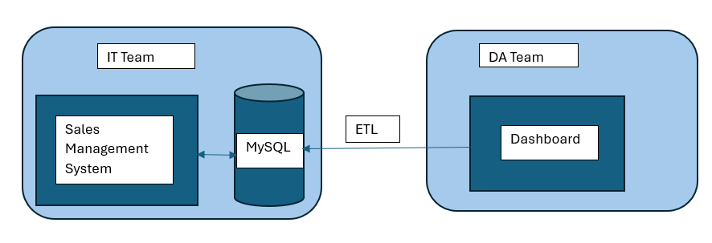

# 📊 Sales Dashboard for A Hardware Company  

## 🚀 Problem Statement  

A leading supplier of computer hardware and peripherals, serves multiple clients across India. With its head office in Delhi and regional offices nationwide, the company operates in a dynamically evolving market.  

Mr. X, the Sales Director, faces challenges in tracking sales trends and obtaining clear business insights. Currently, he relies on verbal updates from Regional Managers overseeing North, South, and Central India. However, these insights are often subjective and may not provide a complete picture. While Mr. X observes declining sales, the lack of a centralized, data-driven approach makes it difficult to pinpoint key areas of concern and growth opportunities.  

### 🔍 Key Challenges  
1. **Lack of Real-Time Insights** – Sales data is scattered, leading to delays in decision-making.  
2. **Subjective Reporting** – Regional Managers provide verbal updates, which may not always be accurate.  
3. **Need for Data-Driven Decisions** – Mr. X requires a clear, concise, and visual representation of business performance.  

---

## 📌 Data Discovery & Project Planning  

### 📋 **AIMS Grid: Project Management Framework**  
A structured approach to efficiently plan and execute the project.  

#### **1️⃣ Purpose**  
🔹 Unlock hidden sales insights for decision support and automation to reduce manual effort in data gathering.  

#### **2️⃣ Stakeholders**  
👨‍💼 **Sales Director** – Oversees business performance.  
📢 **Marketing Team** – Uses insights for promotional strategies.  
📞 **Customer Service Team** – Enhances customer engagement.  
📊 **Data & Analytics Team** – Creates reports and insights.  
💻 **IT Team** – Manages database and infrastructure.  

#### **3️⃣ End Result**  
✅ An **automated dashboard** providing **quick and real-time sales insights** to support data-driven decision-making.  

#### **4️⃣ Success Criteria**  
📈 Dashboard uncovers **sales trends** with the latest data.  
💰 Sales team achieves **10% cost savings** of total spend.  
⏳ Sales analysts stop **manual data gathering**, saving **20% of business time** to reinvest in value-added activities.  

---

## 📊 Flowchart of Project Execution  
1️⃣ **IT Team** – Maintains the **Sales Management System**, a software tracking all sales data. Every transaction generates an **invoice** stored in a **MySQL database**.  
2️⃣ **Data Analysts** – Collaborate with IT to extract data from the **SQL database** for analytics.  
3️⃣ **Dashboard Development** – Use **MySQL as a data source** in **Power BI** to create an interactive **Sales Dashboard**.  

---

## 🖼️ Project Execution Flowchart  
  

---

## 🔥 Conclusion  
By leveraging **Power BI/Tableau**, this dashboard will empower **the Hardware Company** with real-time insights, helping Mr. X make informed decisions and **boost sales performance**. 🚀  
